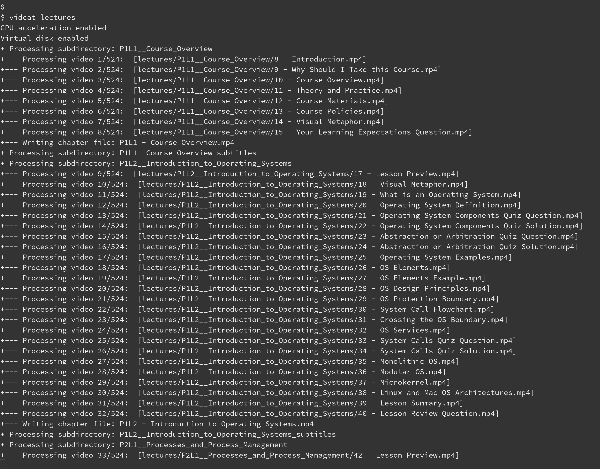

# VidCat: Video Concatenation Tool

VidCat is a Bash script designed to streamline the process of concatenating multiple small video files into a single longer video, using `ffmpeg`.

I created this to address my desire to watch [OMSCS lectures](https://omscs.gatech.edu/) on the go. I found distracting to watch dozens of 2-3min short episodes, on top of the issues that the proprietary mobile apps have in remembering basic preferences like watch speed, or the position you were when you last watched. Also, I wanted to be able to watch on my commute, and I frequently don't have connectivity (looking at you, NYC MTA).

VidCat supports features like:
- Automatic concatenation of dozens/hundreds of videos into chapter-long videos that you can more conveniently watch
- Automatic cover page generation using the file and directory titles
- Customizable encoding parameters (e.g., frame rate, video format, resolution, bitrate)
- Optional NVIDIA GPU acceleration, for faster encoding

VidCat was tested on Ubuntu 22.04, but should work in any modern Linux distro with FFmpeg. The cover page is generated automaticaly *based on the sub-directories and filenames*, so you need to organize your input files in logical order. For example:

```text
./lectures:
    |
    +-- 1. introduction/
    |       |
    |       +-- 1.1 this is the first file.mp4
    |       +-- 1.2 this is the second file.mp4
    |       +-- 1.3 this is the third file.mp4
    |       +-- 1.4 this is the fourth file.mp4
    |       +-- 1.5 this is the fifth file.mp4
    |
    +-- 2. advanced topics/
            |
            +-- 2.1 this is advanced topic 1.mp4
            +-- 2.2 this is advanced topic 2.mp4
```
VidCat will create two files: `1. introduction.mp4`, and `2. advanced topics.mp4`.

> ***Note for OMSCS fellow students***: I've successfuly used this with the downloadable lectures for CS-7646 (ML4T) and CS-6200 (GIOS), but YMMV.
> 
> GIOS lectures are neatly organized in subfolders for each chapter with descriptive names (P1L1, P1L2, P2L4, etc), so it works out of the box. ML4T lectures are all in a single folder (with some random subfolders sprinkled through it), so you'll need to move files around and possibly create subdirectories for each chapter if you'd prefer. Other classes may require similar tweaking.
 
In between each video segment VidCat will add a cover page with the chapter and segment title. For example: 


Font, font sizes and colors are easily customizable; see `vidcat.sh` script for details.

## Features
- **Automatic Cover Pages**: adds a customizable introduction page at the beginning of each concatenated episode.
- **Video Normalization**: ensures all videos match a consistent resolution, frame rate, and format. This adds one-time processing time, but ensures the output video will play on all devices.
- **(optional) GPU Acceleration**: uses Nvidia's nvenc codec for faster video encoding.
- **(optional) in-memory virtual disk for temporary files**: to avoid 

## Usage
Clone the repo (or download the script), and run VidCat with the following command:

```bash
./vidcat.sh <input_directory> [optional output_directory]
```

You should see something like this while processing your videos:



Depending on the size of your original videos, this may take quite a bit to finish. For example, OMSCS GIOS / CS-6200 has 6GB across 576 individual video snippets; it took 35 minutes to reencode videos using GPU acceleration, or 71 minutes on CPU.

## Output
- A video will be created for each chapter (e.g. `chapter 1.mp4`, `chapter 2.mp4`).
- The resulting videos will be reencoded, so resolution, frame rate, bitrate, and cover pages will be added for each episode.
- - A *chapter* is defined as a subdirectory inside `<input directory>`. The script does some minimal sanitization of filenames (e.g. underscores are converted to spaces, and double underscores are replaced by " - "). Spaces characters and spaces are allowed.

## Customization
You can customize the script by editing its parameters directly. Some notable examples:

- **`FRAMERATE`**: Default frame rate (`30000/1001`). Should match the input videos being concatenated
- **`VIDEO_FORMAT`**: default video format. This was only tested with mp4, but should (probably?) work with other formats
- **`INTRO_DURATION`**: Duration of the introductory cover page.
- **`FONT_FILE`**: Specify a custom ttf font for cover page text (also size, colors, and max length)
- **`ASPECT_RATIO`** and **`BITRATE`**: Output video resolution/bitrate. Use the highest resolution of videos segments inside each chapter / subdirectory.
- **`NVIDIA_GPU`**: Enable/disable Nvidia GPU. Default: disabled. See [Troubleshooting](#troubleshooting) if you have any issues.
- **`USE_VIRTUAL_DISK`**: Use in-memory virtual disk for temporary files. Slightly faster, and avoids SSD wear, but requires `sudo` and enough RAM.


## Prerequisites
* [**FFmpeg**](https://www.ffmpeg.org/). Mine is a rather old 4.4.2, so anything after that should work.
* **Bash (Bourne Again shell)**. VidCat relies on Bash's builtin [radarray/mapfile](https://ss64.com/bash/mapfile.html), which is typically [not available](https://www.reddit.com/r/zsh/comments/tt6gm8/why_doesnt_zsh_have_an_equivalent_of_bashs/) in other shells. You'll need to modify if you're trying to port to a non-bash environment.
* (Optional) **GPU Acceleration**. If you have an NVIDIA card and want to use GPU acceleration, ensure your CUDA libraries and drivers are properly installed, and FFmpeg was compiled with GPU support. This will give you a 2-3x acceleration.
* (Optional) **Custom font** for the cover page. I use [WarGames font](https://www.1001fonts.com/wargames-font.html) (see above), becase, why not.
* (Optional) **In-memory virtual disk**. Create a tmpfs virtual disk to store temporary files. Besides performance, it avoids writing several GBs to disk and causing wear on ssd. Disabled by default, as it requires `sudo` (to mount/dismount tmpfs).

## Installation
```bash
# clone the repository and navigate to the directory:
git clone https://github.com/yourusername/vidcat.git
cd vidcat

# make the script executable:
chmod +x vidcat.sh

# download the original lecture videos

# run VidCat to concatenate the videos into chatpers
mkdir output
vidcat.sh /path/to/lecture/videos output/
```

## What video player can I use on my mobile?

There's many good video players, but personally I use VLC. It's available on Android and iOS, it's free, open source, well supported, and full featured.

In particular:
- Create folders for your various videos (for example, one for each class)
- Chromecast support (useful when traveling, and you want to cast to the TV in your hotel)
- Remembers the last position for each video played
- Remembers previous speed
- Allows volume to go over 100% (ideal when the original audio is low, or on noise environments, like subways)
- Double tap to seek forward and backward
- Easy to pause/play videos
- Two finger zoom
- Various gestures - brightness, take screenshots, etc.

Here's how it looks like for my current class (CS 6200).


## Troubleshooting and Known limitations
1. **This takes too long to run!**:
    Yes, indeed. VidCat re-encodes all the videos, so it will take some time. The main advantage is that the resulting file will play without issues on most devices. The original files may have been encoded with different framerate or resolutions, so simply concatenating the segments without reencoding wouldn't work.
    
    Having said that, if you *really* want to want to skip re-encoding the original videos, look for `# normalize original video` section of the script, and change ffmpeg to use `-c:v copy` instead of the default H264 encoder used. But you've been warned!

2. **I don't know which resolution to use**
   Investigate your source files with `ffprobe -i input.mp4 -show_streams -pretty`. Different files may have different resolutions; you can use `utils/find_maxres.sh` on a directory to find the maximum resolution used. `1280:720` is usually a safe bet, or `640:360` is you need to minimize storage space, at the expense of some quality (e.g. for mobile devices).

3. **Output files are much bigger than the original files**:
   You may be using a higher resolution than the original files, or a higher bitrate. Investigate the resolution using `ffprobe -i input.mp4 -show_streams -pretty` (or the `find_maxres.sh` script above), and adjust `ASPECT_RATIO` and `BITRATE` parameters accordingly

4. **The script runs, but no files are generated**:
   FFmpeg output is suppressed by default. Set `FFMPEG_VERBOSE=1` and check for warning/errors on FFmpeg's output.

5. **CUDA_ERROR_COMPAT_NOT_SUPPORTED_ON_DEVICE: forward compatibility was attempted on non supported HW**:
   - Ensure your FFmpeg is compiled with NVIDIA NVENC support.
   - Verify GPU functionality with:
   ```bash
    # check CUDA version (e.g. 2.6) and driver
    nvidia-smi

    # should show up several lines for nvenc
    ffmpeg -encoders -loglevel quiet | grep NVENC
    
    # try to encode a test file. Provide any mp4 input
    ffmpeg -i in.mp4 -c:v h264_nvenc -preset fast -b:v 5M out.mp4
   ```

6. **It doesn't run on my Linux machine**:
   - Ensure you have FFmpeg installed, and you're using bash
   - Open a ticket with details and distro, and I can take a look into it

7. **It doesn't run on my Mac / Windows machine**:
   - One alternative is to run on a Docker container, virtual machine, or under WSL2 if you're using Windows.
   - Unfortunately I don't have the availability now to make the port to Mac/Win, but you can fork and make the necessary adjustments. If you do, ping me your repo and I'll link to it.

## License
This project is licensed under the MIT License.

## Contributions
Contributions are welcome! Feel free to fork the repository, make improvements, and submit a pull request.
